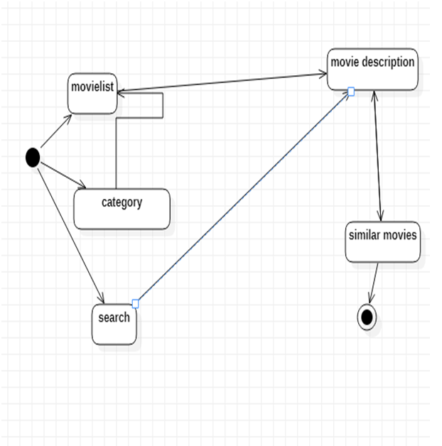
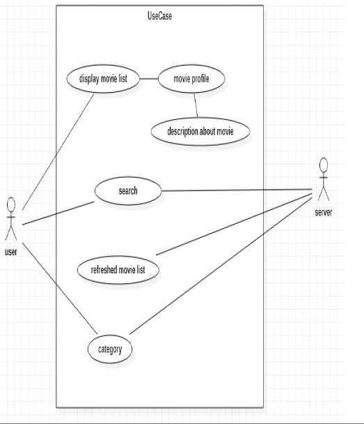

This project is the first project we have developed by react-js. It is aimed at filtering movies based on searches by users, showing the player lists and movie trailers within the movies via data retrieval with an api that has too many movies in it and continues to be updated constantly. React-bootstrap was used in general at the interface of the project. React-router was used and attempts were made to obtain reusable component structure.

About
Modern fast movie database web app with React using The Movie DB API. All the new popular movies are populated along with search bar for your own movie search. Clicking on specific movies bring you all data about the movie including actors, directors, time, budget, revenue, rating and many more.

## Data Flow :

